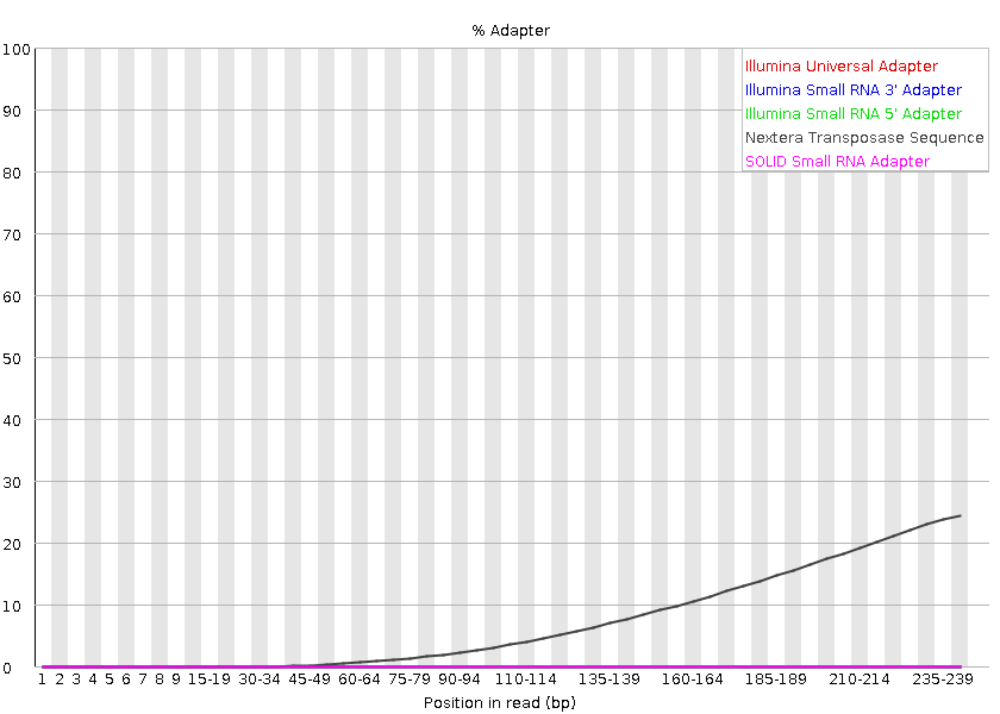

```{r setup, include = FALSE}
# packages
library(dplyr)
library(knitr)
library(xtable)

# settings
knitr::opts_chunk$set(fig.pos = "H", out.extra = "", echo = FALSE, message = FALSE, warning = FALSE)
```

\maketitle
\tableofcontents
\addcontentsline{toc}{section}{Contents}
\clearpage

\section{Primeiro Título}

Aqui você pode colocar todo conteúdo de texto com imagens e gráficos do relatório. Lembre-se sempre de iniciar com "\\section" seguido de "{}" para informar o título corretamente. Mãos à obra!

\subsection{Primeiro subtitulo}

Lorem ipsum dolor sit amet, consectetur adipiscing elit, sed do eiusmod tempor incididunt ut labore et dolore magna aliqua. Ut enim ad minim veniam, quis nostrud exercitation ullamco laboris nisi ut aliquip ex ea commodo consequat. Duis aute irure dolor in reprehenderit in voluptate velit esse cillum dolore eu fugiat nulla pariatur. Excepteur sint occaecat cupidatat non proident, sunt in culpa qui officia deserunt mollit anim id est laborum.

\section{Segundo Título}

Um exemplo de tabela para compor o relatório:

```{r results = "asis"}
tab <- xtable(head(iris, n = 20), align = "|C|C|C|C|C|C|", caption = "Exemplo de legenda de tabela.")

addtorow <- list()
addtorow$pos <- list()
addtorow$pos[[1]] <- -1
addtorow$command <- c("\\rowcolor{igray}")

print(tab,
      include.rownames = FALSE,
      tabular.environment = "tabularx",
      width = "\\textwidth",
      comment = FALSE,
      add.to.row = addtorow)
```

\section{Terceiro Título}

Um exemplo de imagem para compor o relatório:
  
  
```{r teste, fig.cap="Exemplo de legenda de figura.", out.width = "\\textwidth"}

```
